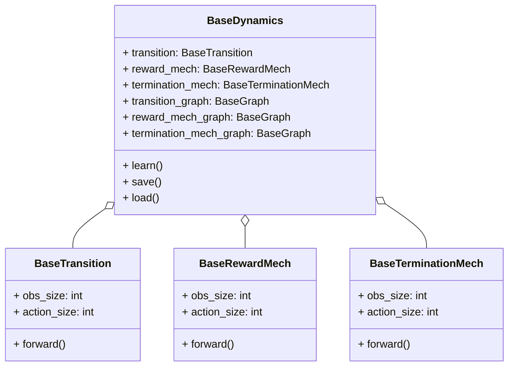
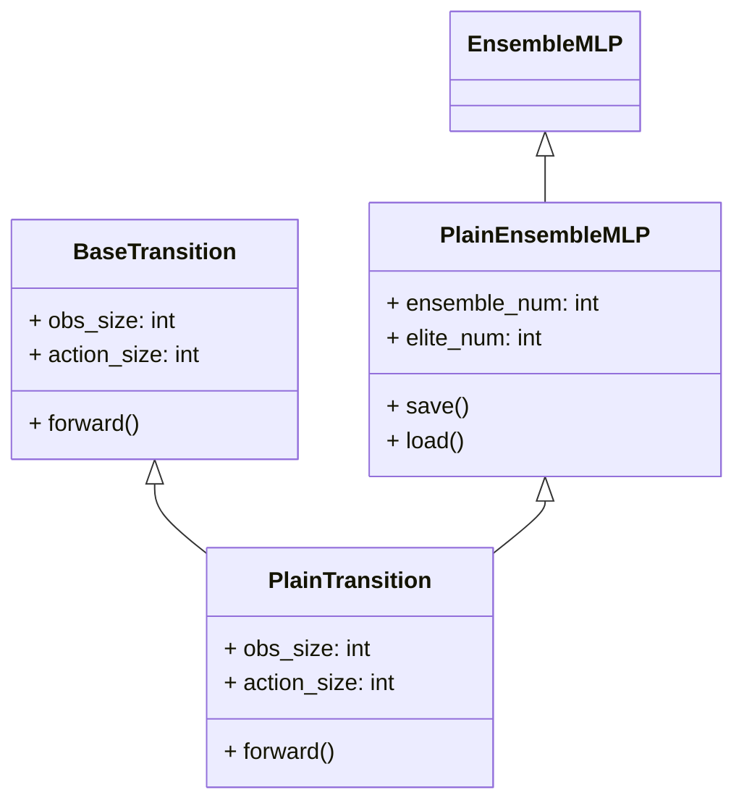

# Causal-MBRL

<a href="https://github.com/FrankTianTT/causal-mbrl"></a>
<a href="https://github.com/FrankTianTT/causal-mbrl"></a>
<a href="https://github.com/psf/black"></a>
<a href="https://github.com/FrankTianTT/causal-mbrl/blob/main/LICENSE"></a>
<a href="https://pre-commit.com/"></a>
<a href="https://www.python.org/downloads/release/python-380/"></a>

`cmrl`(short for `Causal-MBRL`) is a toolbox for facilitating the development of Causal Model-based Reinforcement
learning algorithms. It uses [Stable-Baselines3](https://github.com/DLR-RM/stable-baselines3) as model-free engine and
allows flexible use of causal models.

`cmrl` is inspired by [MBRL-Lib](https://github.com/facebookresearch/mbrl-lib). Unlike MBRL-Lib, `cmrl` focuses on the
causal characteristics of the model. It supports the learning of different types of causal models and can use any model
free algorithm on these models. It uses [Emei](https://github.com/FrankTianTT/emei) as the reinforcement learning
environment by default, which is a re-encapsulation of [Openai Gym](https://github.com/openai/gym).

# Main Features

Thanks to the decoupling between the environment-model and the model-free algorithm, `cmrl` supports all on-policy and
off-policy reinforcement learning algorithms in [Stable-Baselines3](https://github.com/DLR-RM/stable-baselines3)
and [SB3-Contrib](https://github.com/Stable-Baselines-Team/stable-baselines3-contrib). Meanwhile, `cmrl` is consistent
with a number of utilities Stable-Baselines3 (e.g. Logger, Replay-buffer, Callback, etc.).

Although it supports many model-free algorithms, the focus of `cmrl` is the learning of causal models. `cmrl`
uses `VecFakeEnv` to build a fake environment and conduct online reinforcement learning on it. Each 'VecFakeEnv'
corresponds to a dynamics, which is composed of three parts, namely, `Transition`, `Reward-Mech`(short for reward
mechanism) and `Termination-Mech`, look at the class diagram:



`cmrl` encapsulates the neural networks commonly used in causal-model-based RL, including `PlainEnsembleMLP`
, `ExternalMaskEnsembleMLP` and so on. For any mechanism in dynamics, it should be a subclass of any `MLP` and its
corresponding base class. For example, look at the class diagram of `PlainTransition`:



# Installation

## install by cloning from github

```shell
# clone the repository
git clone https://github.com/FrankTianTT/causal-mbrl.git
cd causal-mbrl
# create conda env
conda create -n cmrl python=3.8
conda activate cmrl
# install torch
conda install pytorch -c pytorch
# install cmrl and its dependent packages
pip install -e .
```

for pytorch

```shell
# for MacOS
conda install pytorch -c pytorch
# for Linux
conda install pytorch pytorch-cuda=11.6 -c pytorch -c nvidia
```

for KCIT and RCIT

```shell
conda install -c conda-forge r-base
conda install -c conda-forge r-devtools
R
```

```shell
# Install the RCIT from Github. 
install.packages("devtools")
library(devtools)
install_github("ericstrobl/RCIT")
library(RCIT)

# Install R libraries for RCIT
install.packages("MASS")
install.packages("momentchi2")
install.packages("devtools")

# test RCIT
RCIT(rnorm(1000),rnorm(1000),rnorm(1000))
```
## install using pip

coming soon.

# Usage

```shell
python -m cmrl.exmaples.main
```

# Contributing

see [CONTRIBUTING](CONTRIBUTING.md) for details.
